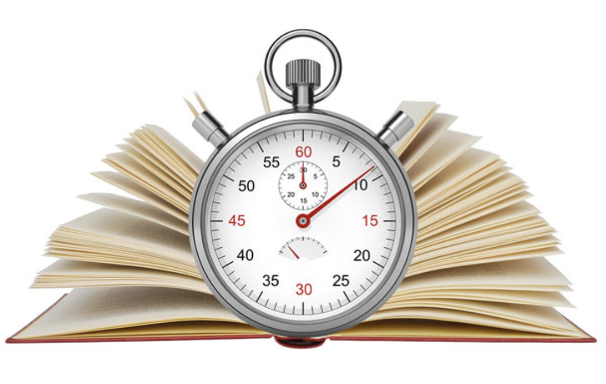
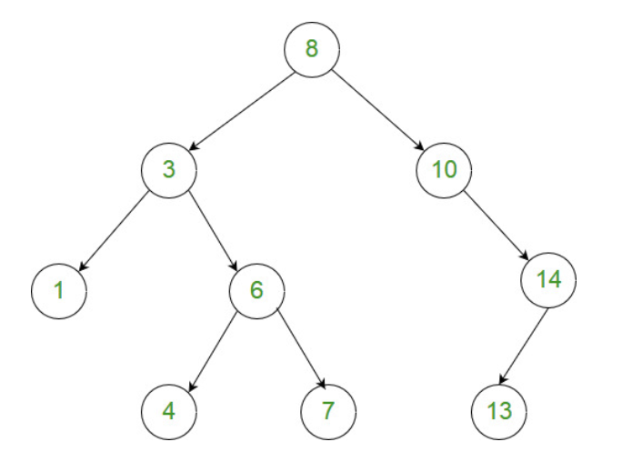
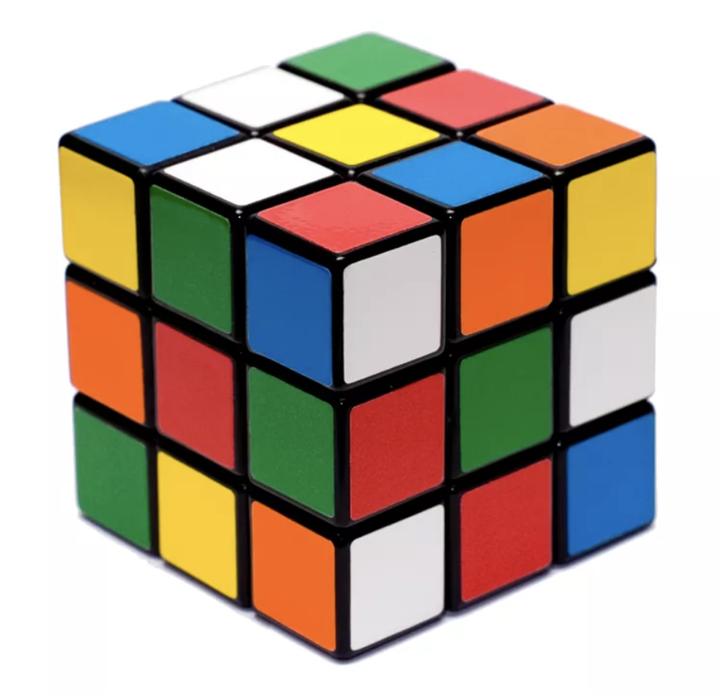

# Speed Reading with the Right Brain
## Learn to read ideas instead of just words

* **ISBN:** 9781548063894
* **Conceptual reading:** imagining / visualizing what you are reading

## Reading Strategies:
* **left brain:**
	* serial processing, one-step at a time
	* subvocalization
		* pronouncing words while reading is the limiting factor / bottleneck
		* maximum ~200 words per minute ( wpm )
	* rapid serial visual presentation
		* helps to see words faster by *not* allowing time for subvocalization of individual words
		* seeing words faster is *not* reading faster
		* the rate of physical eye movement is the limiting factor
		* maximum ~500 words per minute ( wpm )

* **right brain:** parallel processing of abstract thoughts and ideas
	* read chunks / phrases at a time as conceptualized ideas
	* look for patterns of information simultaneously
	* holistic understanding of entire chunks of data as ideas or concepts

The left brain and right brain have different personalities and see the world in different ways.  But it is
the partnership of this odd couple which allows us to make careful analyses and leaps of intuition.

## What is speed reading?
* Text-to-Idea transformation
	* knowledge transfer objectively measured by rate of comprehension
	* reading faster is equivalent to comprehending faster
		* instead of reading words, focus on seeing ideas

Real reading is something that occurs AFTER you recognize the words.  It is what happens
when you realize what the writer is saying / thinking when writing the words.  You haven't
read anything until you've comprehended it.

There is no clock in your mind.  Reading speed is very flexible and relative to your thinking speed.
If you can comprehend faster, you will be thinking faster, but what you read will always seem to be
taking place at "normal" speed in your mind.

## Strategy
* Focus on *comprehending* faster and *reading* faster will naturally follow
* Forget about how *fast* you are reading and focus on *what* you are reading
* Reading is comprehension and comprehension is conceptualization

## Goals
* read whole phrases at a time as if they were single words
	* phrase highlighting helps to practice
	* acquire proper mindset for reading phrases by understanding how / why phrase highlighting works
* develop a personal heuristic for a dynamic phrase highlighting algorithm
	* practice on un-highlighted text ( non-deterministic process, there is no right or wrong )
	* focus attention on meanings of phrases being read by comprehending larger chunks of information at a time
	* extract keywords which tie the overall structure of sentences / paragraphs together
		* common keywords are nouns and verbs
		* usually the *first* word of a sentence and *last* word of each phrase

## Practice
* reading text in larger chunks transfers greater amounts of information per glance
	* easier and faster to concentrate on the meaningful concepts
	* emphasizes the true limiting factor, comprehension
		* prioritize comprehension first
		* speed reading occurs as a natural side-effect of speed comprehending
* specially formatted text at the end of each chapter
	* First 1,000 words from various sources
	* Reading speed = 60,000 / # seconds to read the first 1,000 words = words per minute ( wpm )
		* objective measurement of reading speed
* Online phrase reading tool
	* [http://phrasereader.com/](http://phrasereader.com/)
* Children's books
	* I love reading to my children!  Here's how I've been learning to speed read on my own:
		1. look at the middle of the text on the page
		2. coalesce all words in parallel as a whole phrase transformed into a single, concise thought
		3. "see" the meaning of that concise thought in my mind's eye through visualization / conceptualization
			* note: this is an internal subconscious automatic function of my right brain
		4. look at the picture in the book
		5. repeat above steps as needed until full comprehension is acquired
		6. verbalize the meaning to my kids
	* small, concise chunks of meaningful data at a time
	* perfect for visualizing words as phrases and transforming those phrases into thoughts / meanings / ideas / images
	* there's literally a picture of the text's meaning in the book ( visualization of the meaning is simply a glance away )
		* the glance location is irrelevant as meaning of the text and the picture of the text are the same
			* i.e. looking at text and visualizing its meaning is the same exact concept as looking at the picture and visualizing its meaning

## Practice: Focus on How You are Reading
* "Practices does not make perfect.  Only perfect practice makes perfect."
	* Vince Lombardi
* Practice creates habits ( both good and bad habits )
	* The *type* of practice matters more than the *amount* of practice
	* Example good / bad practice for "learning how to type"
		* bad: hunt + peck faster with two-finger strategy looking at the keyboard
		* good: proper hand position and memorization of key locations
* 3 stages to **acquire** a **new skill**
	1. **cognitive stage:** focused thought required to perform a task
	2. **associative stage:** improve accuracy + efficiency, much less concentration required to perform a task
	3. **autonomous stage:** perform task automatically with barely any conscious effort at all
* Secrets to reaching higher levels of any skill
	* conscious control while practicing and staying out of autopilot mode
Comprehension and speed improve by staying consciously mindful of the concepts / ideas being expressed while reading.
Similarly, reading skill improves by staying consciously mindful about *how* you are reading.
* Force your brain to adapt
	* the brain restructures itself to meet cognitive demands
	* training your brain to handle data more quickly improves your brain's ability to assimilate information
* Memory storage
	* repetition creates long lasting enhancements to signal transmission capabilities between neurons
	* the more you practice a skill, the stronger your memory of that skill becomes

## Speed Reading is Speed Comprehending
* acquire clearer / faster comprehension
	* conceptualize phrases of words by imagining what the group of words mean
		* transfer data to the right side of your brain for parallel processing
		* imagine whole, complex ideas at once, as a single, cohesive thought
	* distinct pieces of information are whole units of meaning ( ideas which can be visualized / conceptualized )
		* actively seek conceptual units of information
			* *not* smooth, consistent flows of evenly distributed data
			* more like clumps of ideas, look for the clumps, that will help you see them
		* proactive searching frame of mind causes clumps to automatically appear for you

## Why Learn to Speed Read?
* we live in the internet age where we are surrounded by information as text available on-demand
	* new era of do-it-yourself education
	* infinite amount of reading material
	* reading speed is the limiting factor to acquiring knowledge
	* superior reading skills provide greater access to information
* physically enhanced brain
	* boost memory, focus, concentration, and analytical thinking
	* increased awareness of life by having a deeper reality of what things actually mean
	* your mind is what you "feed" it ( similar concept: "you are what you eat" )
* cost-benefit analysis
	* cost
		* time investment
		* it's free, time is continually refunded by reading faster
	* benefit
		* enjoyable to read, comprehend, and organize data into useful knowledge to be better informed
		* the more you know, the easier to becomes to know more by correlating new data with known data
		* increased comprehension and retention of data is necessary in today's fast changing technical world

## 3 Mind Tricks
**1. Read meaningful group of words at a time**
* *etymological examples of coalesced words as holistic ideas:*
	* 1940: *percent*
		* *per* meaning *for-each*
		* *cent* meaning *one-hundredth*
	* 1890: *forever* meaning *for-a-while*
	* 1925: *nearby* meaning *near-by-house*
	* 1960: *worthwhile* meaning *worth-your-time*

The point is, it has always been possible to read words together as long as the word-groups formed meaningful ideas;
reading phrases is just a further extension of this process of thinking and communicating in larger, more complex
conceptual ideas.

**2. Concentrate on Whole Ideas instead of Words**
* It's *not* possible to pronounce two words simultaneously, one atop the other.  Even if you could the result would be a cacophony of meaningless audible wavelengths.
* Likewise, it's *not* possible to think of separate words simultaneously.
* It is possible to think of the complete idea as a single thought represented by a group of words
	* Words have definitions, but real meaning is determined by the way multiple words are combined together
	* Word-groups are easier to visualize and understand compared to piecemeal standalone words themselves

**3. Conceptualize the Meaning of these Ideas**
* Actively think about what you read
	* causes the right brain to "see" the idea
	* avoid "blanking out" which occurs when looking at words without understanding their meaning
	* experience the idea VS looking at words and listening to words

## Two Types of Information
* **Episodic** information involve space and time
    * real-world concrete things
    * physical observations
* **Semantic** information involve abstract ideas
    * categories
    * concepts

*Example*: **"he is running faster than ever"**
* **"he is running"** is episodic information
* **"faster than ever"** is semantic information

When conceptualizing while reading, episodic information is faster and easier to imagine
then semantic information.  It is easier to think of real world things than abstract ideas.
Although processing semantic information takes more effort, it is an ability which makes us
unique as humans.  We can understand how the past affects the present and use this information
to prepare for the future.

## Consciousness
The prefrontal cortex is the conscious part of the brain which constantly filters out important
and irrelevant data.  This is also where the brain becomes aware of text as information.
* short-term working memory
* analyze, combine, compare, evaluate data

Speed reading requires conscious attention to actively extract ideas from text.
The more conscious you are, the more aware you are, the more you are actually living.
Attention is the "you" inside your brain.  More attention means more you.

## Memory
A complex web of connected information.
* Stores ideas and concepts (not data like a computer)
    * Distributed throughout a network of associated attributes
    * Altered each time they are accessed, so they change over time

## Concentration and Focus
**Concentration** is applying more mental resources to your reading, it's thinking
more about what the information means.  Increased concentration is like shining
a brighter light on a subject.  In this way, concentrating on your reading makes
the information clearer and easier to see.

**Focus** is tuning out internal or external distractions in order to narrow your attention
to the material at hand.  Focus increases your mental efficiency by minimizing the waste
of resources.  Increased focus is like looking at the subject though a magnifying glass,
as it strengthens attention on the information being read and reduces attention to distractions.

## Mindset
Your attention is a precious and finite resource.  Direct it towards the end-goal of reading: comprehension.
* Attention is variable
    * Some people have more attention and are more conscious than others
    * A conscious mind can be strengthened with practice/exercise
* Benefits of speed reading exercises and good technique:
    * expand memory and become more intelligent
    * focus attention, maintain better concentration and focus
    * efficient use of working-memory of the conscious mind
    * suppress internal/external distractions
* Simple trick to increase attention
    * Pretend I am reading info to teach it to someone else
    * My future self is that someone else that I can teach this material to

## Preparation
* Prepare your brain for reading and learning by relaxing your mind and body.  Relaxation clears your
working memory, erasing that mental white board.  Relaxation also calms the amygdala and prefrontal cortex (your emotional and conscious areas of the brain).  These two areas work closely together and will communicate better when they are undistracted and uncluttered.
* The amygdala is the hub of emotional responses and can produce a stimulating effect on the prefrontal cortex.
The prefrontal cortex is the seat of executive function; it regulates your thoughts, actions, and emotions.
There is a strong connection between these two regions and distractions in one will affect the other.
Relaxing your mind clears the communication channel between them.
* Examples:
    * Close eyes and focus on breathe
    * Smile to create a positive mood, which creates a relaxed and receptive mind

## Patience
* Don't be overly concerned about how long it's taking you to finish reading something
* Focus on the process and ignore the little voice continually asking "are we there yet?"
* Worrying about progress only creates performance anxiety
* Your goal is to read and understand information, concentrate on visualizing the material, and you'll
get there faster

## Variable Reading Speed
Four factors to take into account:
1. information density
    * more complex info takes more time to comprehend
2. information attachment
    * **positive cycle:** the more you know about a subject, the more interesting it becomes, the more you'll want to know more about it
    * developing more interest in a subject also changes your reading from passive to aggressive
        * aggressively seek information as you read
        * don't passively wait for ideas to occur to you
    * **When something seems boring, it's often not material that's boring - it's us!**
3. phrase attachment
    * ideas are phrases of words chained together
        * each phrase attaches to their previous and next phrases to form context and meaning
    * subconscious mental process attaches phrases to one another
4. flow
    * start reading slowly to gain context, once context is established, faster reading can naturally occur
    * the flow of one phrase to the next in the text
    * easier to read well written, naturally flowing words and phrases
* Summary:
    * reading speed varies and this is good
        * increases comprehension
        * keeps our attention

## Replace Bad Habits
* Bad Habits
    1. Subvocalizing
        * internal speech often performed while reading (ie. "saying" the words in our heads)
    2. Regression
        * going back and re-reading what I previous "read"
            * saccades
                * an average reader performs 1 backwards saccade in every 4 forward saccades
            * mind-wandering
                * looking at text and thinking about something completely different (ie. what did that last sentence, paragraph, or page say again?)

* Key to avoid Bad Habits
    * Do *not* attempt to focus on *not* subvocalizing and regressing (ie. this is the same as focusing on things to *not* do!  It's extremely unhelpful and unproductive!)
    * Instead avoid subvocalizing and regression by reading with focused visualization, purpose, and curiosity to proactively extract contextual meanings and thoughts.

## Final Thoughts
### Uniqueness
Your personal meaning of data is created by the selection and significance of attributes you connect to the information
through your previous knowledge, experience, and interests.

### Syntax VS Semantics
I personally learn best by performing active recall and thought experiments while reading books.  Speed reading has helped me to acquire data efficiently and effectively by focusing on the meaning of the content rather than the content itself.

I'd like to share 3 examples of what it means for me to focus on the meaning of content rather than the content itself.
The first examples are recursive algorithms written in C++ code.  The final example is a physical example of a Rubik's cube.

#### Example 1:
**[Problem Statement](https://leetcode.com/problems/maximum-difference-between-node-and-ancestor)**

Given the ```root``` of a binary tree, find the maximum value ```V``` for which there exists **different** nodes ```A``` and ```B``` where ```V = |A.val - B.val|``` and ```A``` is an ancestor of ```B```.

(A node ```A``` is an ancestor of ```B``` if either: any child of ```A``` is equal to ```B```, or any child of ```A``` is an ancestor of ```B```.)



**[Recursive Solution](https://leetcode.com/problems/maximum-difference-between-node-and-ancestor/discuss/292557/modern-C%2B%2B-solution)**
```cpp
class Solution {
public:
    int maxAncestorDiff( TreeNode* root, int ans=0 ){
        go( root, ans );
        return ans;
    }
private:
    using MinMax = pair< int,int >;
    MinMax go( TreeNode* root, int& ans ){
        MinMax same{ root->val, root->val };
        if( ! root->left && ! root->right )
            return same;
        auto[ minL, maxL ] = root->left?  go( root->left, ans )  : same;
        auto[ minR, maxR ] = root->right? go( root->right, ans ) : same;
        ans = max({ ans,
                    abs( root->val - minL ),
                    abs( root->val - minR ),
                    abs( root->val - maxL ),
                    abs( root->val - maxR ),
        });
        return{ min({ minL, minR, root->val }), max({ maxL, maxR, root->val }) };
    }
};
```

When I look at this C++ code, I see a post-order binary tree traversal.  At each level of the recurrence, the minimum and maximum
values of ancestor nodes are propogated back up the recursive stack and the answer is the maximum of all possible answers
deductively found per the problem statement's overlapping subproblems and optimal substructure.

The semantics of this code may be easier to "see" in the mind's eye with a preorder traversal of the tree.
Rather than propogate min/max values back up the recursive stack, simply track the min/max during the traversal.
When the base case is reached, then calculate the maximum difference as the maximum minus the minimum seen
in the recursive callstack thus far, and recursively return the solution as the maximum
of the left/right sub-tree solutions.

```cpp
class Solution {
public:
    int maxAncestorDiff(TreeNode* root) {
        return go(root, root->val, root->val);
    }
private:
    int go(TreeNode* root, int mini, int maxi) {
        if (!root)
            return maxi - mini;
        mini = min(mini, root->val);
        maxi = max(maxi, root->val);
        return max(go(root->left, mini, maxi), go(root->right, mini, maxi));
    }
};
```

#### Example 2:
**[Problem Statement](https://leetcode.com/problems/divisor-game/)**

Alice and Bob take turns playing a game, with Alice starting first.

Initially, there is a number ```N``` on the chalkboard.  On each player's turn, that player makes a move consisting of:

* Choosing any ```x``` with ```0 < x < N``` and ```N % x == 0```.
* Replacing the number ```N``` on the chalkboard with ```N - x```.

Also, if a player cannot make a move, they lose the game.

Return ```True``` if and only if Alice wins the game, assuming both players play optimally.

**[Recursive Solutions](https://leetcode.com/problems/divisor-game/discuss/292472/C%2B%2B-solutions%3A-Top-Down-and-Bottom-Up)**
```cpp
namespace TopDown {
    class Solution {
    public:
        bool divisorGame( int N ){
            return go( N );
        }
    private:
        using Memo = unordered_map< int, bool >;
        bool go( int N, Memo&& memo={}, int turn=0 ){
            if( memo.find( N ) != memo.end() )
                return memo[ N ];
            if( N == 1 )
                return memo[ N ] = turn == 1; // alice wins if there are no moves left and it is bob's turn
            for( int i=1; i <= N/2; ++i )
                if( N % i == 0 && go( N-i, move( memo ), turn^1 ) )
                    return memo[ N ] = true;
            return memo[ N ] = false;
        }
    };
}
namespace BottomUp {
    class Solution {
    public:
        using Collection = bitset< 1001 >;
        bool divisorGame( int N, Collection dp={} ){
            dp[ 0 ] = true;
            for( auto i{ 1 }; i <= N; ++i )
                for( auto j{ 1 }; j <= i/2; ++j )
                    if( i % j == 0 && ! dp[ i-j ] ){
                        dp[ i ] = true;
                        break;
                    }
            return dp[ N ];
        }
    };
}
```

Fundamentally, this is a basic algorithm.  Alice wins if and only if there are no moves left and it is Bob's turn.
When I look at this C++ code, I once again see the recurrence formula based on the problem statement.  The top-down solution
uses recursion with memoization to solve each overlapping subproblem exactly once.  The top-down solution is acquired
after the base cases are reached and the answer is propagated back up the recursive stack.  The bottom-up solution uses the same
recurrence formula but in reverse by starting at the base case and building upon the recurrence of overlapping subproblems
until the final solution is reached.

### Example 3:



I learned to solve a Rubik's cube by memorizing the "beginners method", which is basically an algorithmic sequence
of deterministic twists-and-turns combined with idempotent loop-invariants used to formulate a bottom-up solution.

Look at the instructions below and find there's a handful of sequences which can be semantically chunked
into a visual right-side of the brain.  When first learning these sequences, its serial processing of the left-brain,
one twist, followed by the next, and so on.  Once the meaning of that sequence is comprehended and embedded
as a chunk of data which can be visualized by the right-brain, then and only then does the sequence flow in
effortless harmony.

* [Rubik's Cube Tutorial and Resource Guide](https://claytonjwong.github.io/rubiks-cube/)

About a year after I started practicing with a Rubik's cube, I was easily able to solve the 3x3 cube in under 2 minutes
using the beginner's method.  At this time I started learning the Fridrich method, which is also known by via the acronyms
F2L, OLL, and PLL (ie. first two layers, orientation of the last layer, and permutations of the last layer).  It was extremely
beneficial to master the beginner's method before I started learning this method, since the beginner's method provides
a basic intuitive understanding of how each piece moves and the potential adverse affects of those moves upon other pieces.

#### Algorithms and Speed Reading
In summary, thinking algorithmically requires a similar mental leap of faith necessary for speed reading.  And the first step
at acquiring these skillsets is to simply try.  Try to "see" meaning with the mind's eye.  This was *not* a fast, immediate
process.  Instead I slowly acquired this skillset, a little bit at a time each day.  I slowly reduced the amount of time necessary
to understand the idea / concept behind the code, from weeks to days to hours to minutes to seconds.  Now I can observe these
"oh yeah, duh!" moments in my mind's eye more efficiently and effectively.

>"Take the first step in faith.  You don't have to see the whole staircase.  Just take the first step."
> -- Dr. Martin Luther King Jr.

The idea of focusing knowledge transfer on understanding ideas, is simple, but *not* easy.  Like all things in life,
it takes time and practice.  Simply practice to learn a little at a time each day.

## Objective Measurements
I started actively trying to speed read via rapid serial visual presentation ( RSVP ).  With the RSVP strategy,
I was able to read ~400 wpm.  Now I'm focusing on reading chunks of data at a time, and I've observed my reading speed
has decreased significantly, however I believe my rate of reading will increase with practice conceptualizing ideas
in word phrases.
* **Chapter 1: The Velveteen Rabbit**
  * *2023-06-26:* **361** wpm
* **Chapter 2: Pride and Prejudice**
  * *2019-05-16:* **181** wpm
  * *2023-06-24:* **431** wpm
* **Chapter 3: The Picture of Dorian Gray**
  * *2019-05-17:* **216** wpm
  * *2023-06-25:* **375** wpm
* **Chapter 4: The War of the Worlds**
  * *2019-05-18:* **206** wpm
  * *2023-07-01:* **337** wpm
* **Chapter 5: Treasure Island**
  * *2019-05-21:* **179** wpm
  * *2023-07-03:* **346** wpm
* **Chapter 6: The Wonderful Wizard of Oz**
  * *2019-05-23:* **258** wpm
  * *2023-07-04:* **461** wpm
* **Chapter 7: The Adventures of Tom Sawyer**
  * *2019-06-17:* **183** wpm
  * *2023-07-05:* **301** wpm
* **Chapter 8: The Strange case of Dr. Jekyll and Mr. Hyde**
  * *2019-06-27:* **218** wpm
  * *2023-07-06:* **359** wpm
* **Chapter 9: White Fang**
    * *2019-06-27:* **214** wpm
    * *2023-07-09:* **361** wpm
* **Chapter 10: Memoirs of Sherlock Holmes**
  * **2019-07-06:* **200** wpm
  * **2023-07-08:* **363** wpm
* **Chapter 11: The Voyages of Dr. Dolittle**
  * *2019-07-12:* **230** wpm
  * *2023-07-09:* **400** wpm
* **Chapter 12: The Life and Adventures of Robin Crusoe and Daniel Defoe**
  * *2019-09-25:* **226** wpm
  * *2023-07-10:* **405** wpm
* **Chapter 13: Gulliver's Travels**
  * *2019-09-27:* **254** wpm
  * *2023-07-11:* **375** wpm
* **Chapter 14: Twenty Thousand Leagues Under The Sea**
  * *2019-10-01:* **250** wpm
  * *2023-07-12:* **392** wpm
* **Chapter 15: The Three Musketeers**
  * *2019-09-29:* **242** wpm
  * *2023-07-13:* **359** wpm
* **Chapter 16: Moby Dick**
  * *2019-10-01:* **214** wpm
  * *2023-07-14:* **342** wpm
* **Chapter 17: Frankenstein**
  * *2019-10-01:* **205** wpm
  * *2023-07-15:* **425** wpm
* **Chapter 18: The Scarlett Pimpernel**
  * *2023-07-17:* **392** wpm
* **Chapter 19: Little Women**
  * *2023-07-17:* **384** wpm

### 100 one-minute speed reading drills

🎯 Read 600 words per minute (60 seconds)

* **Chapter 1: Pride and Prejudice**
  * *2019-11-27:* **181** seconds
  * *2023-07-19:* **111** seconds
* **Chapter 2: Anne of Green Gables**
  * *2019-12-02:* **168** seconds
  * *2023-07-20:* **122** seconds
* **Chapter 3: Dracula**
  * *2019-12-05:* **156** seconds
  * *2023-07-21:* **75** seconds
* **Chapter 6: Dr. Jekyll and Mr. Hyde**
  * *2023-07-24:* **95** seconds
* **Chapter 7: Richard Wagner**
  * *2023-07-25: **90** seconds
* **Chapter 8: The Life of Marie Antoinette**
  * *2023-07-26:* **89** seconds
* **Chapter 9: Grow Rich While You Sleep**
  * *2023-07-27:* **87** seconds
* **Chapter 10: How To Use Your Mind**
  * *2023-07-28:* **92** seconds
* **Chapter 11: The Eve of the French Revolution**
  * *2023-07-29:* **86** seconds
* **Chapter 12: Think and Grow Rich**
  * *2023-07-30:* **77** seconds
* **Chapter 13: Success Thru Public Speaking**
  * *2023-07-31:* **84** seconds
* **Chapter 14: The Art of Thought Reading**
  * *2023-08-01:* **93** seconds
* **Chapter 15: Economics in One Lesson**
  * *2023-08-02:* **82** seconds
* **Chapter 16: A Journey to the Center of the Earth**
  * *2023-08-03:* **88** seconds
* **Chapter 17: History of World War I**
  * *2023-08-04:* **89** seconds
* **Chapter 18: Around the World in Eighty Days**
  * *2023-08-12:* **91** seconds
* **Chapter 19: Huckleberry Fin**
  * *2023-08-13:* **106** seconds
* **Chapter 20: The Autobiography of Benjamin Franklin**
  * *2023-08-14:* **91** seconds
* **Chapter 21: A Young Girl's Diary**
  * *2023-08-15:* **86** seconds
* **Chapter 22: Four Great Americans**
  * *2023-08-16:* **73** seconds
* **Chapter 23: The Adventures of Pinocchio**
  * *2023-08-17:* **71** seconds
* **Chapter 24: Dubliners**
  * *2023-08-18:* **91** seconds
* **Chapter 25: What's Coming After WWI**
  * *2023-08-19:* **82** seconds

### Update 2020-07-17
So I realize I have significant room for improving reading speed and comprehension.  I'm able to avoid subvocalizing as I read now, however, subvocalizing has been the only strategy I've used to read for the majority of my life.  Anyhow, I stopped timing myself a while ago after I've identified a significant bottleneck in my comprehension due to limited vocabulary.  And about a year ago, I started expanding my vocabulary via flash cards for GRE preparation. That was super boring, so I found an app named [Elevate](https://www.elevateapp.com/) which has been very helpful!  I've consistently used this app for 2-3 minutes each day, and its a more enjoyable method to learning new words.

### Update 2021-05-19
I've been using speed reading each morning to read the news, and it has been helpful for [Leetcode Contests](https://leetcode.com/claytonjwong/).  I have multiple Q1 solutions AC in less than one-minute.  This would be impossible without speed reading (speed comprehension).

* [See LeetCode Screenshares on YouTube](https://www.youtube.com/user/claytonjwong/videos)

### Update 2023-07-20
When I first timed my reading speed in 2019, I read around 200 wpm.  Now in 2023, I can read ~400 wpm, which is super cool: I've doubled my reading speed in about 4 years.  Reading is super enjoyable!  The upshot: it takes time and effort to change my mind.  For me, learning has been an upward sprial and is a self-sustaining life-long project.